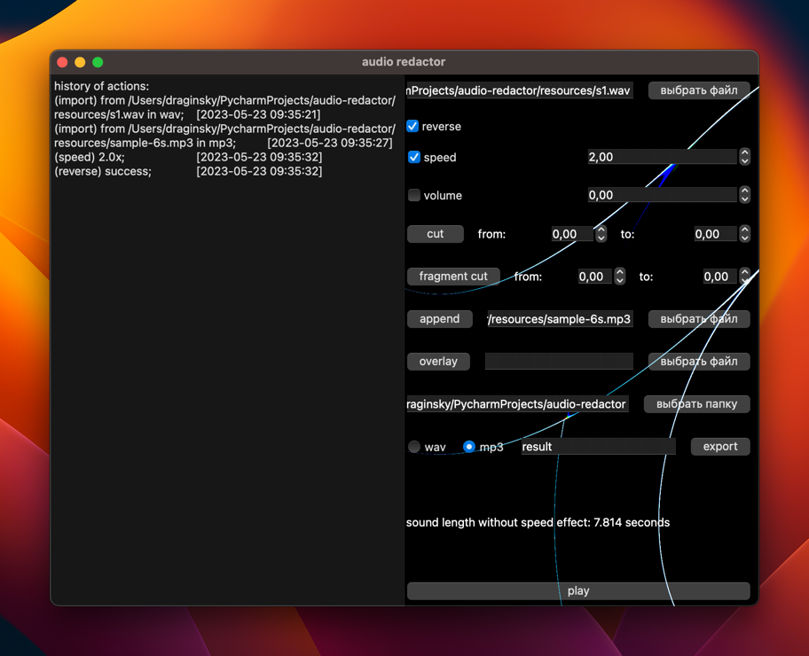

# audio-redactor

### Author:

Дрягин Максим

### Description

Приложение с графическим интерфейсом для редактирования аудиофайлов в форматах wav и mp3.

### Features:

- [x] разрезка/склейка
- [x] вырезание фрагмента
- [x] изменение громкости
- [x] изменение скорости
- [x] наложение нескольких аудио фрагментов
- [x] reverse звука
- [x] экспорт звука
- [x] проигрывание звука без экспорта
- [x] сохранение истории на один сеанс программы

